# TECH ENVIRONMENT SETUP
## Implementing mini project 1
This showcases the first mini project on DevOps learning track, 3MTT cohort 3.

### Tools I have installed
1. Installation of Visual studio code (VScode)

VSCODE Welcome page
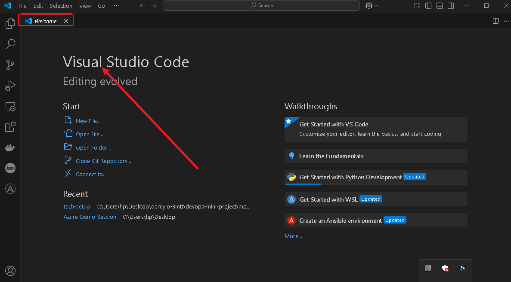

2. Git installation
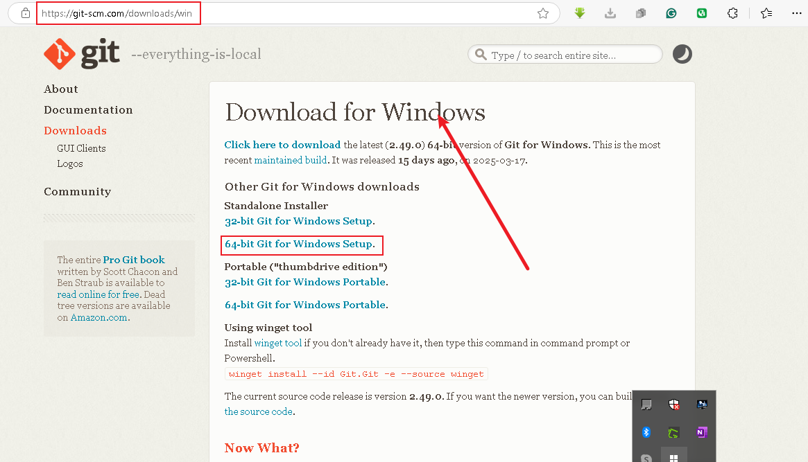

Git Install Confirmation
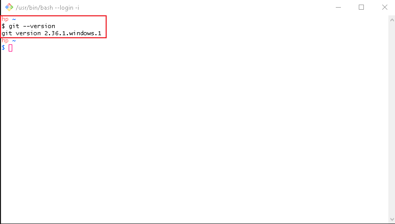

3. Git User Interface
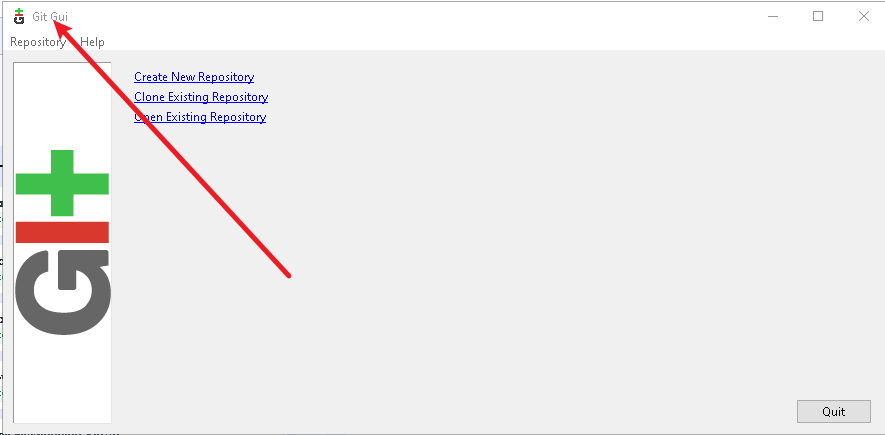

4. Virtual Box Download
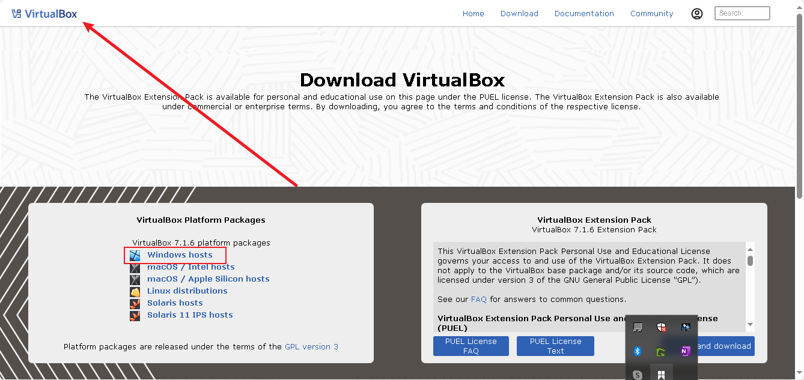

5. Virtual Box Install
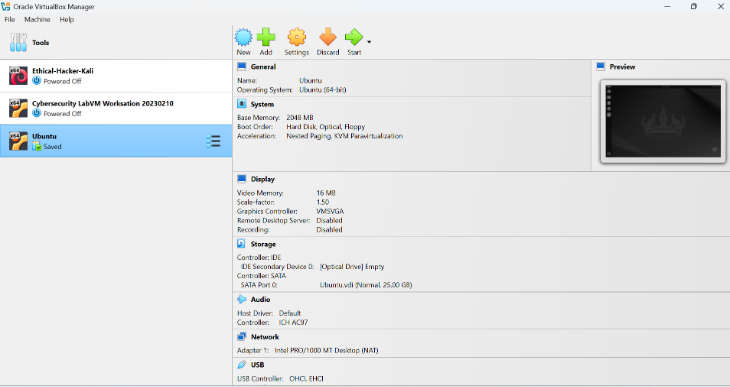

5. Ubuntu Distro on Virtual Box
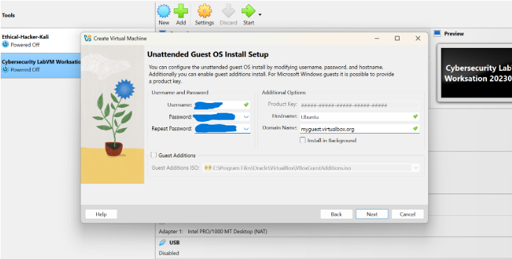

### Accounts Created
1. Amazon Web page
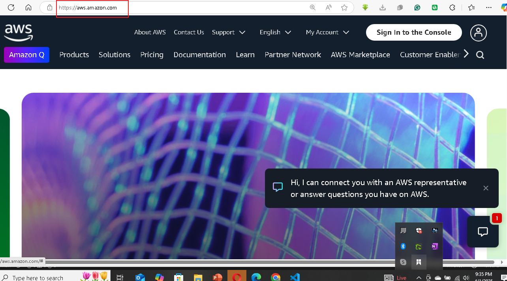

2. AWS Login Page
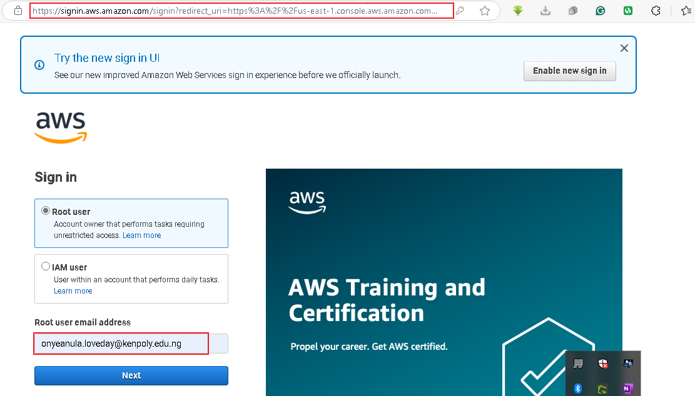

3. AWS Console
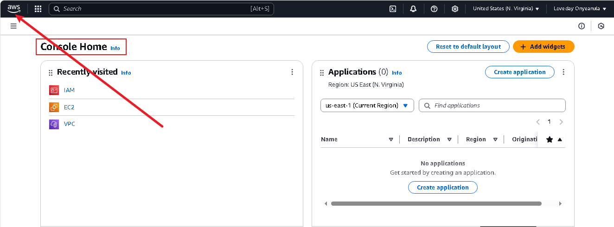

4. Git Hub Account (UI)
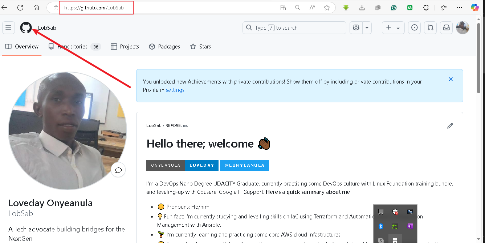