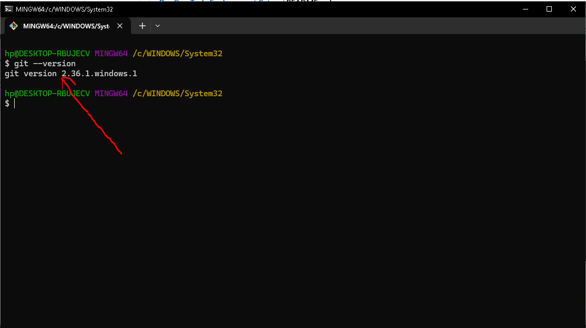
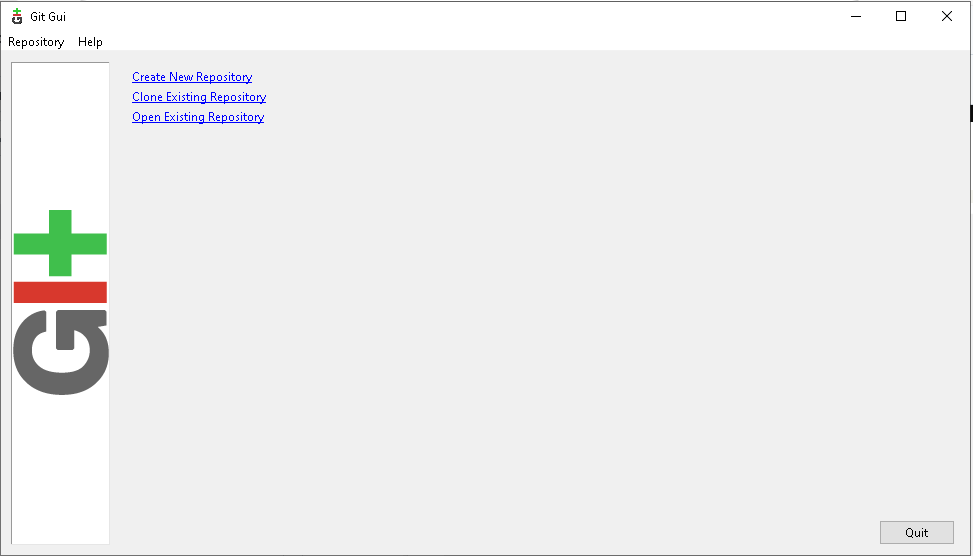

# TECH ENVIRONMENT SETUP
## Implementing mini project 1
This showcases the first mini project on DevOps learning track, 3MTT cohort 3.

### Tools I have installed
1. Installation of Visual studio code (VScode)

2. Git installation

3. Git User Interface

4. Virtual Box Installed

5. Ubuntu Distro on Virtual Box

### Accounts Created
1. Amazon Web Account Sign-in page

2. AWS Console

3. Git Hub Account (UI)
