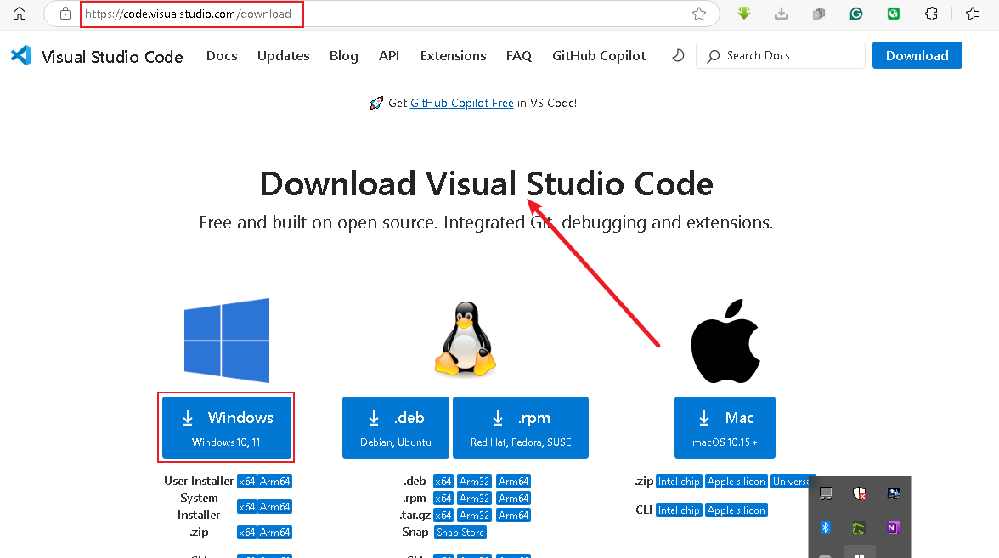

# TECH ENVIRONMENT SETUP
## Implementing mini project 1
This is a comprehensive implementation of mini project 1 that is specifics to the environment setup. This project provides detailed instructions on installation and setup of essential working software working tool and accounts

### Project Prerequisites
1. Internet connectivity
2. **System specification:** A windows PC of 8GB RAM with corei series processor and 64bit architecture.

### Tools Needed to be Installed
1. Visual Studio Code
2. Git
3. Virtualbox

### Accounts to be Created
1. AWS account
2. GitHub account

### INSTALLING THE SOFTWARE TOOLS
#### 1. Visual Studio Code (Code Editor)
Click on this link to download visual code editor for installation [Visual Studio Code Editor - IDE](https://code.visualstudio.com/download)

Now the vscode has been downloaded and installed by clicking on prompts.

#### 2. Git
To install Git on your PC, click on this link
[Git Download](https://git-scm.com/downloads)

Its been already installed and here is the git terminal called **Git Bash**

#### 3. Virtualbox
VirtualBox is a free and open-source, cross-platform virtualization software that allows you to run multiple operating systems (like Windows, Linux, or macOS) simultaneously on a single physical machine. 

To install a virtualbox on windows PC, click on this link [VirtualBox](https://www.virtualbox.org/wiki/Downloads)

Already installed and here it's

### Creating Accounts
#### 1. Amazon Web Account
This is the cloud platform that will be used for the implementation of the DevOps projects

>The Sign-in page

>AWS Dashboard

#### 2. Git Hub Account
The Git Hub is an open-source version control system use in managing deployment and configuration in the devOps. Here's the user interface

>Git Hub User Interface
